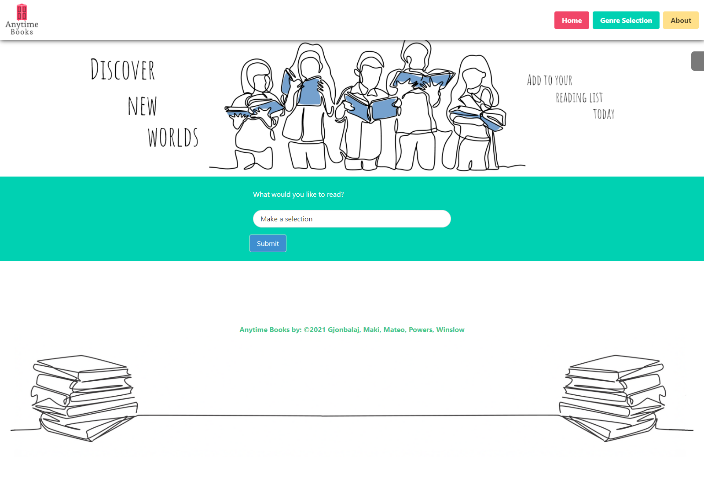
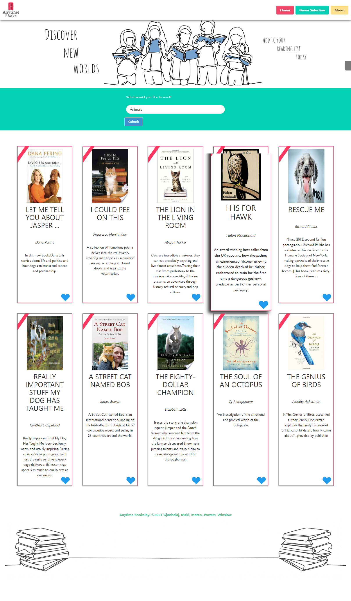
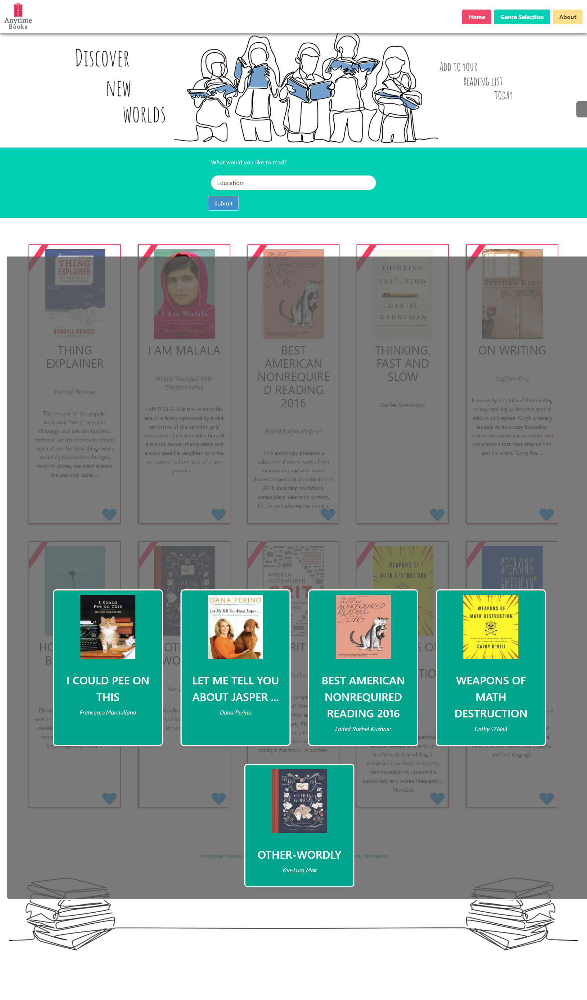
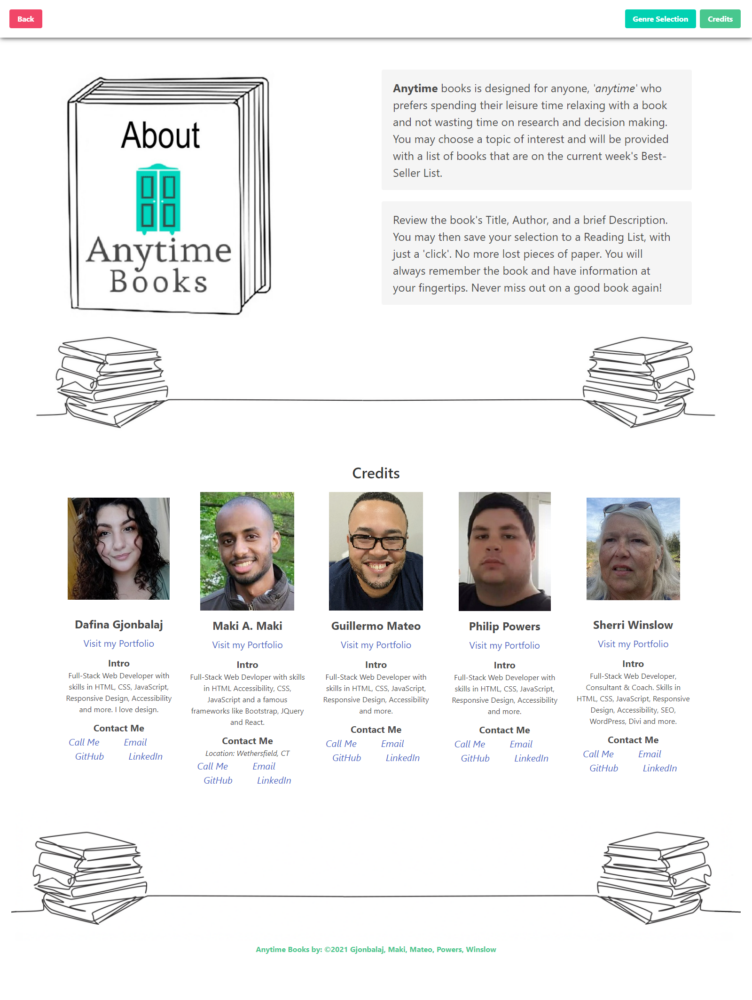

# Anytime Books Angular

## Description

Anytime Books is a solution to book lovers' continuous search for the next read. Our site recommends best sellers based on the reader's genre of choice and allows the reader to save any book of interest, in the list, for easy future access.

The application provides a simple user interface where users select a genre, from a drop-down list, and receive a small list of best-selling books, of related interest.  They can then review the Title, Author, cover, and a brief description of the book.  The user can then add books to a reading list that will be saved to their local devices for retrieval later. Hence, 'Anytime Books!'.  Users can then look at their saved reading list, where they will be able to again view the book's cover, title, and author.

The 'Best Seller' book list will change weekly to present the user with the latest best sellers, offering a continued variety of reads.

## Page Link

https://makispear.github.io/Anytime-Books/

## Table of Contents

- [User/Developer Story](#story)
- [Installation](#installation)
- [Usage](#usage)
- [Credits](#credits)

## Built With

- HTML
- CSS
- Bulma CSS Framework
- Server-side APIs
- JavaScript

## Code link

https://github.com/Makispear/Anytime-Books/

## Visuals

Main Page

Books Selected

Save List

About Page

## Story

AS A user

- I WANT to cut the time it takes to find information about popular books
  - SO THAT I can find my next book, make a reading list, and start reading more books.

CRITERIA

- GIVEN THAT I need to find books of interest, review information, or make a selection of books that I am interested in and cultivate a reading list
  - WHEN I load the application,
    - THEN I want to view a clean and simple interface that doesn't take a lot of time to use.
  - WHEN I click on the selector for books
    - THEN I am presented with a list of genres, or topics, that I can choose from.
  - WHEN I click on a genre, or topic,
    - THEN a list of books appears.
  - WHEN I look at the list, to choose a book
    - THEN I see an image of the book cover and can review information about the book.
  - WHEN I have chosen a book that I am interested in.
    - THEN I can click on a selector
    - THEN the selection will be saved to a reading list.
  - WHEN I want to review my reading list
    - THEN I can select a tab to view the saved books.
    - THEN I can view information about the books I have saved.
  - WHEN I want information about Anytime Books or its developers
    - THEN I can use the navigation links to go to an About page.

As A developer

- I WANT information about Anytime Books.
  - SO THAT I can contact the developers, contribute to the project, view more information and/or view the code.

CRITERIA

- GIVEN THAT I want to contact the developers
  - WHEN I load the application
    - THEN I can click on the About link, in the navigation bar
    - THEN I will be able to see contact information for each developer, in the credits.
  - WHEN I want to contribute to the project or view the code or readme.
    - THEN I can click on the About link
    - THEN I can click on a developer's GitHub link, in the credits.

## Installation

The application can be displayed in a web browser and was built mobile first to be responsive to a variety of devices and screen sizes.

## Usage

For personal, non-commercial, and educational use and participating developer's portfolio purposes.

## Roadmap

Initial release: 

The current application includes the ability to select from a Best Seller list and save information, in local storage (on your device), for future use (retrievals, and additions). Currently, it does not cross-sync between devices.

Future features:

- Provide users a way to delete an unwanted book.
- Provide users a way to mark a book as read.
- Provide users to links to sites for purchasing books or reading reviews.
- Provide feedback to other users with a like or dislike entry and count.

## Credits

Developers:

- Dafina Gjonbalaj
- Maki A Maki
- Guillermo Mateo
- Philip Powers
- Sherri Winslow

This project was pair-coded, by the above developers, in a variety of ways. We worked together to get initial functionality, with a bare-bones html. Afterwards, each developer worked individually, and in pairs, on different aspects of the project. Although, each had a primary focus, we met as a group and pair-coded and resolved issues, helping each other to provide a quality product, that we hope you will enjoy.

Dafina Gjonbalaj and Philip Powers focused on overall design, colors, and branding and the navigation/header and footer. Guillermo Mateo and Maki A. Maki focus of JavaScript coding, APIs and local storage for the save list. Sherri Winslow focused on documentation: an about page for developer information and contact and the readme. This was truly a group effort that learned to meet challenges and obstacles together.

## Acknowledgments

Acknowledgements: University of Connecticut Educational Team: including Dan Seskey, Matt Torcellini, Symone Varnado, Maura Fortino.

### ©2021 Gjonbalaj, Maki, Mateo, Powers, Winslow
